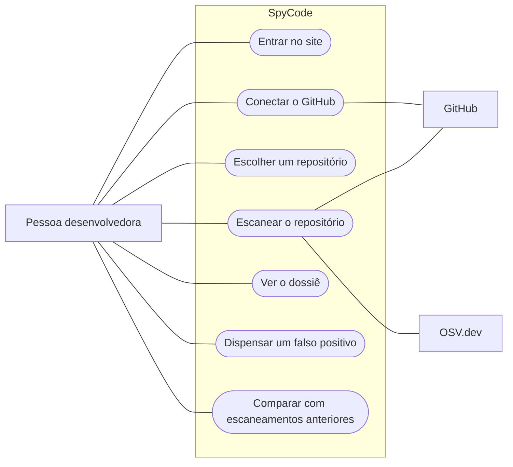
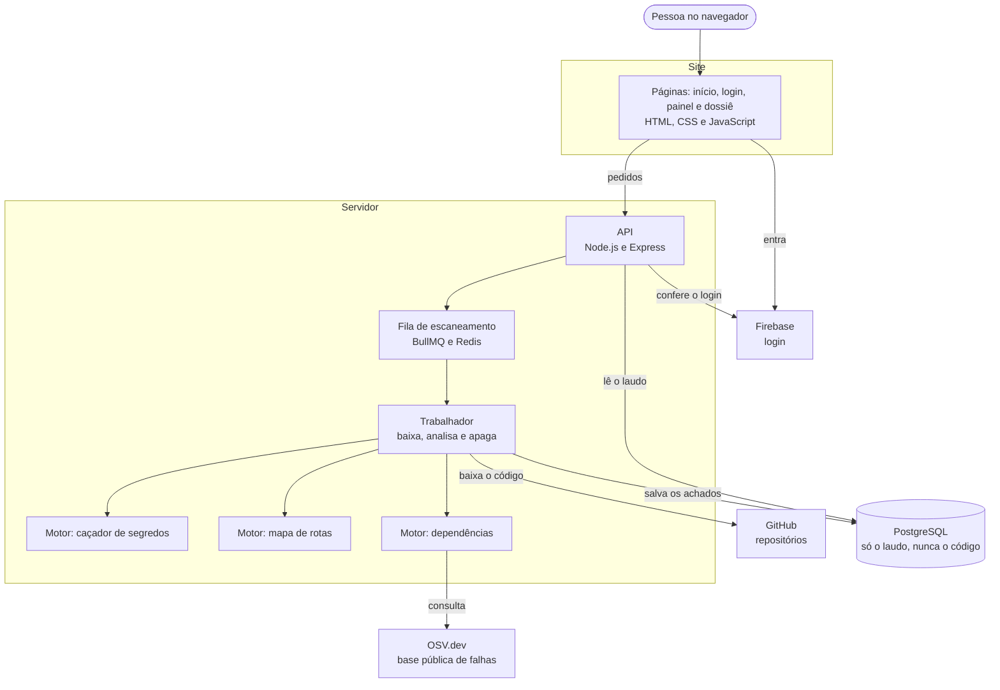
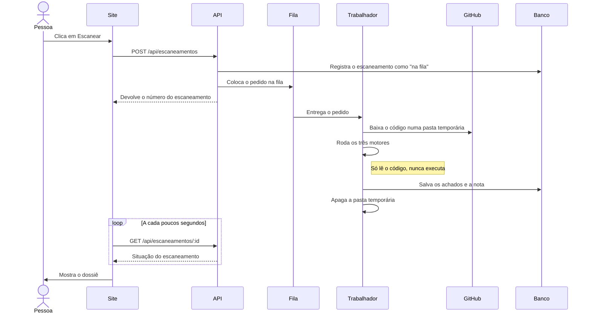
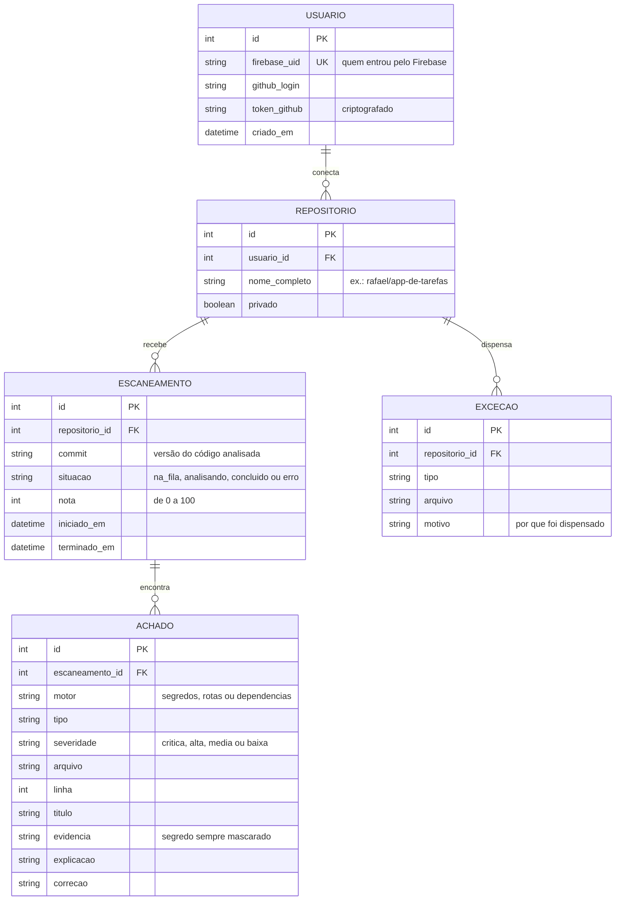

# Como o SpyCode vai funcionar

Prévia planejada do sistema: o que a pessoa faz, por onde os dados passam, quais tecnologias usamos e o que fica guardado no banco.

> **Situação em outubro de 2026:** a página inicial e a tela de login estão prontas. Todo o resto deste documento é plano e só muda com o grupo de acordo.

**Em resumo**

- **Linguagem:** JavaScript, no site e no servidor.
- **Servidor:** Node.js com Express.
- **Banco de dados:** PostgreSQL, acessado com Prisma.
- **Login:** Firebase, com GitHub, Google ou e-mail.
- **Primeira versão:** analisa só projetos em Node.js com Express.

## 1. Casos de uso

O que a pessoa consegue fazer no SpyCode e com quais sistemas de fora ele conversa.



### Caso principal: o Rafael escaneia o projeto dele

- **Quem:** Rafael, estudante de desenvolvimento, que sabe pouco de segurança.
- **Objetivo:** saber se o projeto está seguro antes de colocar no ar e no currículo.
- **Antes de começar:** ter conta no GitHub e um projeto em Node.js com Express.

**Passo a passo**

1. Rafael entra no SpyCode com a conta do GitHub.
2. O painel mostra os repositórios dele.
3. Ele escolhe `rafael/app-de-tarefas` e clica em **Escanear**.
4. A tela mostra o andamento: na fila, analisando, concluído.
5. Por trás, o SpyCode baixa uma cópia do código, lê com os três motores sem executar nada, salva o laudo e apaga a cópia.
6. Rafael abre o dossiê: a nota, uma chave exposta, uma rota aberta e uma biblioteca com falha, cada uma com explicação e correção.
7. Ele corrige, envia o código de novo ao GitHub e escaneia outra vez. A nota sobe e o histórico mostra a evolução.

**E se...**

- **Rafael entrou com Google ou e-mail:** o painel pede para conectar o GitHub antes do primeiro escaneamento.
- **O repositório é grande demais:** o SpyCode recusa e diz qual é o limite.
- **A análise passa do tempo máximo:** ela para e o SpyCode avisa.
- **Um achado não é problema de verdade:** Rafael marca como dispensado e ele não volta nos próximos escaneamentos.
- **Dá erro no meio:** a cópia do código é apagada do mesmo jeito.

## 2. Mapa do sistema



| Peça | O que faz |
| --- | --- |
| Páginas do site | O que a pessoa vê e clica. |
| Firebase | Faz o login e confirma para a API quem está logado. |
| API | Recebe os pedidos do site, confere o login e responde com os dados. |
| Fila | Guarda os pedidos de escaneamento em ordem, para nenhum se perder e o servidor não travar. |
| Trabalhador | Pega um pedido da fila, baixa o código, chama os motores, salva o laudo e apaga o código. |
| Motores | Leem o código e devolvem uma lista de achados. Um não depende do outro. |
| PostgreSQL | Guarda usuários, repositórios, escaneamentos e achados. |
| OSV.dev | Base pública e gratuita de falhas conhecidas em bibliotecas. |

## 3. Um escaneamento do começo ao fim



## 4. Tecnologias

O projeto inteiro usa **JavaScript**, no site e no servidor. Assim o grupo trabalha com uma linguagem só, e os projetos que o SpyCode analisa também são em JavaScript.

| Parte | Tecnologia | Para que serve | Situação |
| --- | --- | --- | --- |
| Site | HTML, CSS e JavaScript puro | As páginas que a pessoa vê | Página inicial e login prontos |
| Login | Firebase Authentication | Entrar com GitHub, Google ou e-mail | Pronto no site; falta ligar à API |
| Servidor | Node.js com Express | A API que o site chama | Planejado |
| Banco de dados | PostgreSQL com Prisma | Guardar usuários, escaneamentos e achados | Planejado |
| Fila | BullMQ com Redis | Rodar os escaneamentos em ordem | Planejado; plano B: uma tabela no PostgreSQL |
| Leitura do código | @babel/parser | Transformar o código em árvore (AST) para achar as rotas | Planejado |
| Base de falhas | API do OSV.dev | Saber quais versões de biblioteca têm falha | Planejado |
| Testes | Jest e Supertest | Testar os motores e a API | Planejado |
| Hospedagem | Render ou Railway, com GitHub Actions | Colocar o site e a API no ar | Planejado |

**Por que PostgreSQL:** os dados se ligam uns aos outros. Uma pessoa tem repositórios, um repositório tem escaneamentos e um escaneamento tem achados, e um banco relacional é feito para isso. Ele é gratuito, e o Render e o Railway oferecem.

**Por que Prisma:** as tabelas ficam descritas em um arquivo só (`schema.prisma`) e o código fala com o banco em JavaScript, sem escrever SQL na mão.

## 5. Os três motores

Cada motor é uma função: recebe a pasta com o código e devolve uma lista de achados, todos no mesmo formato. Por isso cada pessoa consegue fazer um motor sem esperar as outras.

| Motor | O que procura | Como procura |
| --- | --- | --- |
| Caçador de segredos | Chaves, tokens, senhas e arquivo `.env` enviado ao GitHub | Padrões conhecidos (um token pessoal do GitHub começa com `ghp_`) e textos aleatórios demais para serem palavras, no código atual e no histórico de commits |
| Mapa de rotas | Rotas abertas sem login e configurações perigosas: CORS aberto, falta de `helmet`, falta de limite de pedidos, cookie sem proteção | Lê o código com `@babel/parser`, encontra `app.get`, `router.post` e as outras rotas, e confere se há um middleware de login antes |
| Dependências | Bibliotecas com falha conhecida | Lê o `package.json` e o `package-lock.json` e consulta o OSV.dev |

**Exemplo de achado**, no formato que todo motor devolve:

```json
{
  "motor": "rotas",
  "tipo": "rota-sem-autenticacao",
  "severidade": "alta",
  "arquivo": "src/routes/users.js",
  "linha": 42,
  "titulo": "Rota DELETE /users/:id sem autenticação",
  "evidencia": "router.delete('/users/:id', removeUser)",
  "explicacao": "Qualquer pessoa na internet pode apagar usuários.",
  "correcao": "Coloque o middleware de autenticação antes da função da rota."
}
```

A gravidade aceita só quatro valores: `critica`, `alta`, `media` e `baixa`. Quando o achado é um segredo, a evidência chega sempre mascarada, como `ghp_****************************a1b2`.

**Como a nota é calculada:** começa em 100 e cai a cada achado: 25 pontos por crítico, 10 por alto, 4 por médio e 1 por baixo, sem passar de zero. Uma chave exposta (crítica), uma rota aberta (alta) e uma biblioteca com falha (média) dão 100 − 25 − 10 − 4 = **61**.

## 6. Banco de dados

O banco guarda o laudo, nunca o código.



| Tabela | O que guarda |
| --- | --- |
| `usuario` | Quem entrou e o token do GitHub, criptografado |
| `repositorio` | Os repositórios que a pessoa conectou |
| `escaneamento` | Cada análise: a versão do código, a situação e a nota |
| `achado` | Cada problema encontrado, com explicação e correção |
| `excecao` | Os achados que a pessoa marcou como "não é problema" |

## 7. Telas

| Tela | Arquivo | Situação |
| --- | --- | --- |
| Página inicial | `frontend/index.html` | Pronta |
| Login | `frontend/login.html` | Pronta |
| Painel | `frontend/dashboard.html` | Planejada. É para onde o login já leva. |
| Dossiê | `frontend/dossie.html` | Planejada |
| Recursos, Sobre e Segurança | `frontend/recursos.html`, `sobre.html`, `seguranca.html` | Em construção |

- **Painel:** os repositórios da pessoa, o botão **Escanear** e a última nota de cada um.
- **Dossiê:** a nota, quantos achados há de cada gravidade, a lista de achados com explicação e correção, e o mapa de rotas com o cadeado aberto ou fechado.

## 8. Endereços da API

| Método | Endereço | O que faz |
| --- | --- | --- |
| `GET` | `/api/repositorios` | Lista os repositórios da pessoa no GitHub |
| `POST` | `/api/escaneamentos` | Pede um escaneamento novo |
| `GET` | `/api/escaneamentos/:id` | Mostra a situação e a nota de um escaneamento |
| `GET` | `/api/escaneamentos/:id/achados` | Lista os achados de um escaneamento |
| `POST` | `/api/excecoes` | Marca um achado como "não é problema" |

Todos os endereços exigem login. É exatamente o que o mapa de rotas cobra dos outros projetos.

## 9. Pastas planejadas

```
Projeto-Integrador/
├── frontend/                   o site (já existe)
├── backend/                    a API e os motores (a criar)
│   ├── src/
│   │   ├── servidor.js         liga a API
│   │   ├── rotas/              os endereços da API
│   │   ├── fila/               a fila e o trabalhador
│   │   ├── motores/
│   │   │   ├── segredos.js
│   │   │   ├── mapa-de-rotas.js
│   │   │   └── dependencias.js
│   │   └── banco.js            a conexão com o PostgreSQL
│   ├── prisma/
│   │   └── schema.prisma       as tabelas do banco
│   ├── testes/
│   └── package.json
└── docs/                       documentação e desenhos
```

## 10. Regras de segurança do próprio SpyCode

Valem para todas as partes, sem exceção:

- Nunca executar o código de ninguém. Só ler.
- Nunca guardar o código: baixar, analisar e apagar, mesmo quando dá erro.
- Segredo sempre mascarado: na tela, no banco e no log.
- Token do GitHub criptografado no banco, com a menor permissão possível.
- Ignorar links simbólicos do repositório, que podem apontar para fora da pasta temporária.
- Limite de tamanho do repositório e de tempo por escaneamento.
- Limite de pedidos na própria API e nenhuma senha em texto puro.
- O repositório do SpyCode passa pelo próprio scanner antes de cada entrega.

## 11. Quem faz o quê

O back-end se divide em quatro módulos, um por pessoa. Como todos os motores devolvem o mesmo formato de achado, ninguém precisa esperar o outro terminar.

| Módulo | O que entrega | Responsável |
| --- | --- | --- |
| 1. Plataforma e GitHub | Login ligado à API, lista de repositórios, fila, download e exclusão do código, hospedagem | A definir |
| 2. Caçador de segredos | Motor de segredos, varredura do histórico e lista de exceções | A definir |
| 3. Mapa de rotas | Motor de rotas e checagem de configuração. É o mais difícil. | A definir |
| 4. Dependências e painel | Motor de dependências, painel, dossiê e nota | A definir |

## 12. Etapas

- [x] Página inicial e tela de login
- [ ] Servidor no ar, com banco e login ligado à API
- [ ] Lista de repositórios e fila de escaneamento
- [ ] Os três motores
- [ ] Painel, dossiê e histórico
- [ ] Testes em projetos de colegas, com autorização, e caça a falso positivo
- [ ] Código congelado duas semanas antes da entrega

## 13. Ainda em aberto

- **Ligar o login à API.** Hoje o login guarda só o nome e o e-mail no navegador. Para escanear, o site precisa mandar à API o token de login do Firebase e, no login com GitHub, o token do GitHub, que só aparece nesse momento.
- **Repositório privado com só leitura.** O login com GitHub pelo Firebase usa um OAuth App do GitHub, e nele a permissão que lê repositório privado (`repo`) também permite escrever. Para cumprir a regra da menor permissão, a saída é um GitHub App com permissão só de leitura do conteúdo. Sugestão: começar só com repositórios públicos.
- **Front-end.** O desenho original previa React; o grupo está usando HTML, CSS e JavaScript puro. Confirmar que fica assim.
- **Datas e responsáveis.** Falta a data de entrega e quem pega cada módulo.
